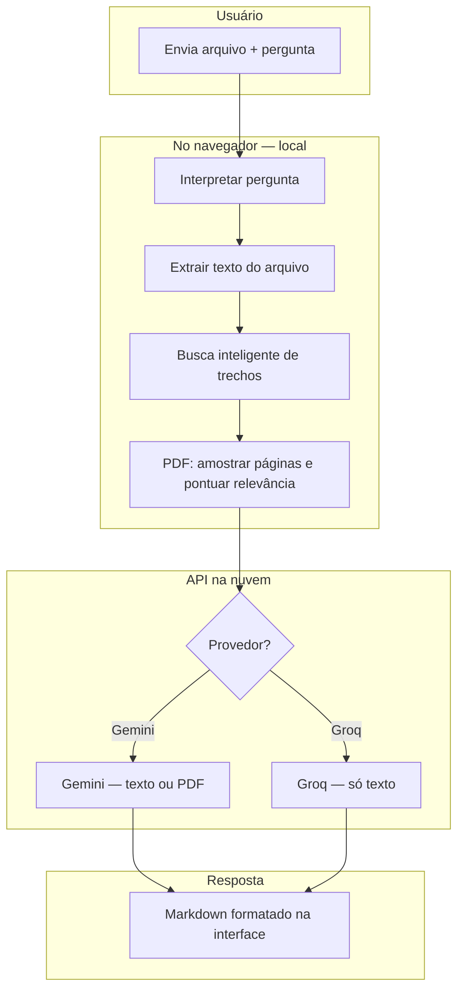

# Leitor de Documentos e Planilhas (IA)

Ferramenta para ler **PDF**, **DOCX**, **XLSX** e **CSV**, fazer perguntas em linguagem natural e receber respostas de IA. O produto principal é a **extensão Chrome** (painel lateral); há também um **CLI em Python** para testes locais.

**Provedores de IA:** [Google Gemini](https://aistudio.google.com/apikey) e [Groq Cloud](https://console.groq.com/keys).

---

## Visão geral



O sistema **não envia o arquivo inteiro** em toda pergunta. Antes de chamar a IA, ele tenta entender o que você pediu e enviar só o que é relevante — isso acelera o processo e reduz custo de API.

---

## Como funciona (passo a passo)

### 1. Carregamento do arquivo

Você arrasta ou escolhe um arquivo na extensão. Formatos aceitos:

| Formato | Leitura local |
|---------|----------------|
| **PDF** | Texto por página (PDF.js); se necessário, envio do PDF ao Gemini |
| **DOCX** | Parágrafos e tabelas (Mammoth) |
| **XLSX / CSV** | Planilhas convertidas em texto tabular (SheetJS / parser CSV) |

### 2. Interpretação da pergunta

O módulo `query-understanding.js` classifica o pedido:

| Tipo | Exemplos | Comportamento |
|------|----------|----------------|
| **Visão geral** | "resumo", "principais pontos", "analise completa" | Tende a usar mais conteúdo do documento |
| **Busca** | "onde está…", "qual o prazo…", "encontre…" | Foca em trechos/páginas relevantes |
| **Extração** | "valor da coluna X", "dados sobre…" | Extrai termos e frases-chave |

Também são detectados:

- Texto entre **aspas** (busca exata)
- Expressões como *"sobre o prazo de entrega"*, *"coluna Vendas"*
- **Sinônimos** comuns (prazo → vencimento, limite; valor → custo, total; etc.)

### 3. Busca inteligente local (`smart-context.js`)

Antes de qualquer chamada à API:

1. O documento é dividido em **blocos** (parágrafos, linhas de planilha ou páginas de PDF).
2. Cada bloco recebe uma **pontuação** conforme a pergunta.
3. São selecionados os melhores trechos, com **páginas vizinhas** para contexto.
4. Em PDFs grandes, só as páginas mais relevantes seguem no fluxo (amostragem rápida em documentos com centenas de páginas).

**PDF com texto:** em muitos casos o sistema envia **só o texto** das páginas escolhidas (sem novo upload de PDF) — bem mais rápido.

**PDF escaneado (só imagem):** pouco ou nenhum texto local → uso do **Gemini** com PDF multimodal. A Groq não lê PDF como imagem; nesse caso use Gemini.

### 4. Envio à IA

#### Google Gemini

- **Texto** (DOCX, CSV, XLSX, trechos de PDF): uma requisição `generateContent` com o conteúdo e a pergunta.
- **PDF pequeno (≤ 2 MB):** envio inline na mesma requisição.
- **PDF maior:** upload pela **File API** (resumível, em partes de 8 MB).
- **PDF acima de ~50 MB na análise:** divisão automática em partes menores; cada parte é analisada (até 2 em paralelo) e as respostas podem ser unificadas em uma resposta final.

Limite importante: a API Gemini processa cerca de **50 MB por PDF** na inferência, mesmo que o upload aceite arquivos maiores.

#### Groq Cloud

- API compatível com **OpenAI Chat Completions** (`/v1/chat/completions`).
- Recebe apenas **texto** extraído no navegador.
- Respostas em geral **muito mais rápidas**; ideal para perguntas pontuais em documentos com camada de texto.
- Texto enviado limitado a ~100.000 caracteres por requisição.

### 5. Resposta na interface

- A IA costuma responder em **Markdown** (`**negrito**`, listas, `*itálico*`).
- A extensão **renderiza** esse Markdown (listas, títulos, negrito) na área "Resposta da IA".
- Durante o processamento: **spinner** na caixa de resposta; status apenas na **etiqueta azul** no canto (sem duplicar mensagens).

---

## Provedores: quando usar cada um

| Critério | Google Gemini | Groq Cloud |
|----------|---------------|------------|
| PDF grande (100+ MB) | Sim (divide em partes) | Só via texto extraído |
| PDF escaneado / imagem | Sim (multimodal) | Não recomendado |
| Pergunta específica em PDF com texto | Sim | **Muito rápido** |
| Resumo completo de documento enorme | Sim | Texto truncado se passar do limite |
| Planilhas / Word | Sim | Sim |

Chaves (gratuitas com limites — consulte os sites oficiais):

- Gemini: https://aistudio.google.com/apikey  
- Groq: https://console.groq.com/keys  

### Modelos disponíveis na extensão

**Gemini**

- `gemini-2.5-flash` (padrão, rápido)
- `gemini-2.5-pro` (mais capaz)

**Groq**

- `llama-3.3-70b-versatile` (padrão)
- `llama-3.1-8b-instant` (muito rápido)
- `openai/gpt-oss-120b`
- `openai/gpt-oss-20b`

---

## Extensão Chrome (uso principal)

### Instalação

1. Abra `chrome://extensions/`
2. Ative **Modo do desenvolvedor**
3. **Carregar sem compactação** → pasta `extension` deste repositório
4. Clique no ícone da extensão → abre o **painel lateral**

### Configuração

1. Aba **Configurações**
2. Escolha o **provedor** (Gemini ou Groq)
3. Cole a **chave de API** do provedor selecionado (pode salvar as duas chaves)
4. Escolha o **modelo** → **Salvar configurações**

### Uso

1. Aba **Leitor** → arraste ou escolha o arquivo
2. Digite a pergunta (ou deixe o texto padrão para resumo)
3. **Enviar para IA**

As chaves ficam em `chrome.storage.local` (somente no seu navegador/perfil).

Mais detalhes de instalação: [extension/README.md](extension/README.md)

---

## Estrutura do projeto

```
Leitor de documentos e planilhas/
├── extension/                    # Extensão Chrome (produto principal)
│   ├── manifest.json
│   ├── sidepanel.html            # Interface (Leitor + Configurações)
│   ├── styles.css
│   ├── background.js
│   ├── lib/                      # pdf.js, pdf-lib, SheetJS, Mammoth
│   └── scripts/
│       ├── app.js                # UI, eventos, renderização Markdown
│       ├── storage.js            # Provedor, chaves, modelos
│       ├── file-parser.js        # Extração por tipo de arquivo
│       ├── query-understanding.js # Intenção e termos da pergunta
│       ├── relevance.js          # Pontuação e seleção de trechos
│       ├── smart-context.js      # Orquestra busca local antes da API
│       ├── pdf-text.js           # Texto por página (PDF.js)
│       ├── pdf-splitter.js       # Divisão de PDFs > 50 MB
│       ├── gemini.js             # API Gemini (texto + PDF)
│       ├── groq.js               # API Groq (chat texto)
│       ├── ai-analyzer.js        # Roteador Gemini / Groq
│       └── markdown-render.js    # Exibição formatada da resposta
│
├── main.py                       # CLI Python (testes)
├── requirements.txt
├── .env.example
├── exemplos/
│   └── amostra.csv
└── src/                          # Código Python (CLI)
    ├── analyzer.py
    ├── config.py
    ├── readers/
    └── gemini/
        └── client.py
```

---

## CLI Python (opcional)

Para testar sem o navegador, com **apenas Gemini**:

```powershell
cd "c:\Users\Adm\Desktop\Leitor de documentos e planilhas"
py -m venv .venv
.\.venv\Scripts\Activate.ps1
pip install -r requirements.txt
copy .env.example .env
```

Edite `.env`:

```
GEMINI_API_KEY=sua_chave_aqui
GEMINI_MODEL=gemini-2.5-flash
```

**Exemplos:**

```powershell
# Resumo padrão
py main.py "C:\caminho\arquivo.pdf"

# Pergunta específica
py main.py planilha.xlsx -p "Quais são os 5 maiores valores na coluna Vendas?"

# Só prévia local (sem API)
py main.py exemplos\amostra.csv --preview
```

O CLI não inclui busca inteligente nem Groq — esses recursos estão na extensão.

---

## Limitações conhecidas

| Limitação | Detalhe |
|-----------|---------|
| PDF na API Gemini | ~50 MB por arquivo na **análise** (upload pode ser maior) |
| PDF na Groq | Apenas texto extraível; sem OCR local |
| Planilhas muito grandes | Truncagem em ~120.000 caracteres de texto |
| `.doc` antigo | Não suportado (use `.docx`) |
| Busca local | Heurística + sinônimos — não é um segundo modelo de IA |
| Resumo completo em PDF enorme | Pode levar vários minutos (várias partes + unificação) |

---

## Segurança e privacidade

- **Extensão:** chaves armazenadas localmente no Chrome; requisições diretas para `generativelanguage.googleapis.com` e `api.groq.com`.
- **CLI:** chave no arquivo `.env` (não commitar).
- O conteúdo dos arquivos é enviado à API do provedor escolhido para processamento — consulte as políticas de privacidade do Google e da Groq.
- Não distribua a extensão empacotada (`.crx`) com chaves já salvas.

---

## Licença

Uso interno / projeto em desenvolvimento.
